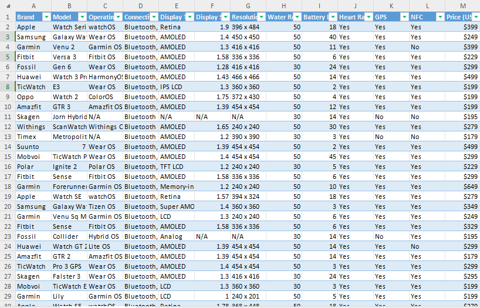
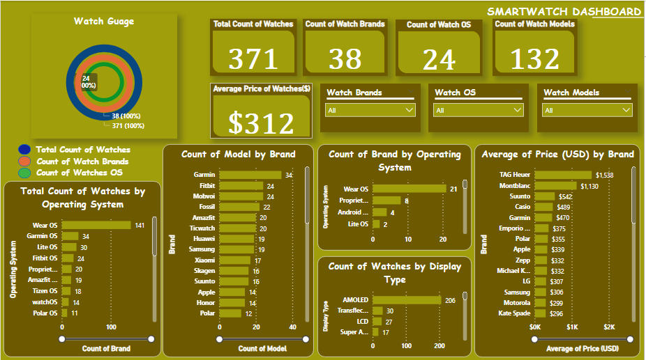

# SmartWatch-Product-Analysis
This is the full breakdown of dataset of 38 Global smartwatches brands who are leaders in the industry, the role of the quality of product in the corresponding market cap of the brands in the Smart watch industry.

## DOCUMENTATION OUTLINE

- [Project Overview](#project-overview)

- [Project Objectives](#project-objectives)

- [Data Sources](#data-sources)

- [Tools Used for Analysis](#tools-used-for-analysis)

- [Data Cleaning, Preparation and Transformation](#data-cleaning-preparation-and-transformation)

- [Observations and Results](#observations-and-results)

- [Recommendations](#recommendations)

- [Contact Info](#contact-info)

## Project Overview
This project involved a dataset containing data on the prices of different brands and models of smartwatches available in the market. The datasets give information about the smartwatches' specifications and how they affect the market price. This data analysis project aims to explore the various specifications of wristwatch brands and look at the more suitable brands in terms of functionality, health specifications, and cost-efficiency for buyers.

## Project Objectives
The data set contains 371 different smartwatch models with different specifications that influence the price of the smartwatches. The following are the insights to be derived from the analysis:

- Total number of smartwatches in the dataset
- Total number of smartwatch brands in the dataset
- Maximum battery life of smartwatches in the dataset
- Minimum battery life of smartwatches in the dataset
- Average price of a smartwatch in the dataset
- Total number of distinct display types used by smartwatches in the dataset
- What are the most common types of operating systems used by the brands?
- How does the most common OS affect the price?
- What are the most common types of displays used by these smartwatches?
- How does the most popular display type affect the price?
- Comparison between the cellular and GPS connectivity and how they affect the price
- Comparison between NFC and GPS and their effect on Price
- Which smartwatches have the health benefit feature of a heart rate monitor and how this affects the price?

## Data Sources
The data was gotten from Kaggle. Data consisted of 380 rows and 13 columns; totals 4940 data entries of data about the top manufacturers of wristwatches worldwide; their watches and features relative to their prices. [check here for data](https://www.kaggle.com/datasets/rkiattisak/smart-watch-prices).

## Tools Used for Analysis
- Ms Excel for Data Cleaning [Download Here](https://www.microsoft.com/en-us/microsoft-365/excel)
- MS Power BI for Report & Visualization [Download Here](https://powerbi.microsoft.com/en-us/downloads/)
- MS Powerpoint for presentation [Download Here](https://www.microsoft.com/en/microsoft-365/powerpoint)
  
## Data Cleaning, Preparation and Transformation
Cleaning and transformation of the data were performed in the Power BI query which included the following:

- Promoted Headers
- Changing of data types
- Removed blank and duplicate rows
- Splitting of columns of combined watch attributes.
- Creating conditional columns to create more measures
- Replacing values
 

## Observations and Results

### Descriptive Analysis
This is a narration of all the key metrics observed in this data.

- There are a total of 371 smartwatches in the dataset with 38 distinct brands, 132 distinct models of smartwatches, and 24 different Operating Systems of smartwatches and the average price of a smartwatch is $312.

- #### SmartWatches Specifics

 Smartwatches Count By Operating System:
- Wear Os has 141 watches using the OS out of 371, that is 38% of the total watches; the most utilized OS by a large margin, followed by Garmin Os, which 34 watches used Garmin Os; special mentions: Android has 5 watches and WatchOS by apple has 14 watches using it.
- we can see that so many brands used wearOS because it has an open-source , has good reliability for a good price, so the goal is to make a watch affordable as possible and still having a good quality
- lets also take note that Android is also an open source software predominantly used in mobile phones, However Watch companies are opting for WearOs instead of Android; this is because WearOs is actually a refined Android OS, Which is tailored to meet the end user needs of a smartwatch and not a mobile phone.

  Smartwatches Count By Brand:
- Garmin has 34 smartwatches in the data , the highest in the dataset, followed by Fitbit and 
Mobvoi at 24 smartwatches each, Apple has 14 watches and raks 12th on the data. for number of watches
- We can see that both Garmin, Apple,Samsung,Polar, Fitbit, Amazfit have their proprietary operating system which are the garmin os and watchos ,TizenOs respectively.

   Smartwatch OS by Brand
- WearOS is used by 21 different brands out of the 38 brands that's about 56% of the brands using this OS, that shows a massive dominance in the operating system sector followed by proprietary operating system which isnt exactly proprietary because about 8 distinct brands make use of this OS; androidOs has 4 brands and Lite Os has 2, the rest OS has just 1 brands.

Wear OS is the most used operating system by the smartwatches in this data totaling 38% of the total smartwatches. It is followed by Garmin OS which is used by 9% of the smartwatches.

AMOLED is the most common display type featured by the smartwatches in this data totaling up to 56% of the total smartwatches.

Despite that Wear OS is the most used operating system, Smartwatches with the Garmin Operating system is more expensive in terms of price compared to Wear OS. On average, a smartwatch with Garmin operating system costs $470.

Despite that AMOLED display type is used by 56% of the smartwatches and OLED display type is used by 4%, smartwatches with OLED display type are higher in price ($576) compared to AMOLED ($304).

The price of the smartwatches is not affected by the NFC feature. However, when compared with the GPS feature, the price of the smartwatch increases with or without NFC features, suggesting that GPS feature most likely increases the price of the smartwatch, unlike the NFC features.

Smartwatches with the cellular type of connectivity have higher price compared to those with the GPS connectivity. This suggests that cellular connectivity is preferred in a smartwatch.

The Maximum battery life of a wristwatch in the dataset is 72 days while the minimum is 1 day.

Findings

Smartwatch model Pro 3 has the maximum battery life of 72 days, followed by Enduro with 70 days, Galaxy Watch at 60 days, and Galaxy Watch 3 at 56 days

Access Brad, Access Gen 5, Access Runway, C2, Falster 2, Falster 3, and G-Shock GS all have a minimum battery life of 1 day.

The TAG Heuer smartwatch brand is the most expensive with the average price of $1,537 while Xiaomi smartwatch brand is the least expensive with the average price of $137 USD.

## Recommendations

## Contact Info
Feel free to reach out to me via email at adelekedavid77@gmail.com or to connect with me on [LinkedIn](http://www.linkedin.com/in/adeleke-davido) for any inquiries & collaboration 

Let's dive into the world of data together and uncover valuable insights!

